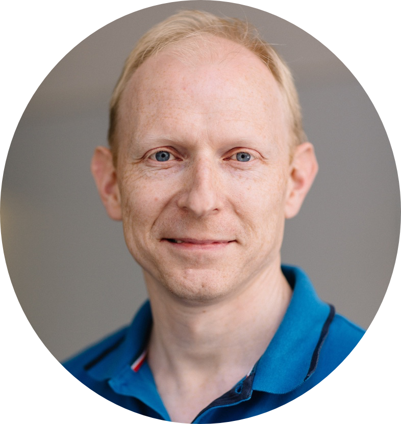
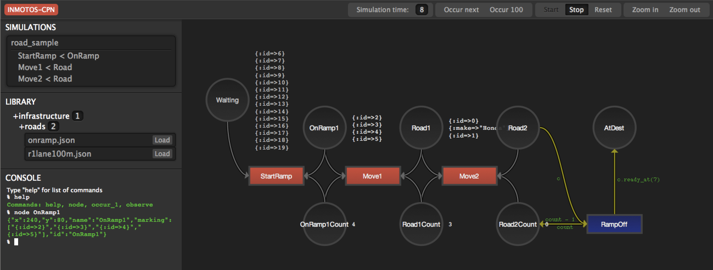

Curriculum Vitae
================
Steen Lehmann <steen.lehmann@gmail.com>

****
[[me]]

****

== Who am I?

I'm a CTO and Software Specialist for the Danish branch of Jayway, which employs some of the best software developers in the industry.
We consult on all aspects of software development, and are owned 100% by the employees.

****
[[info]]
Location: Copenhagen, Denmark +
Languages: Danish, English, Swedish and German +
Twitter:http://twitter.com/slehmann[@slehmann] +
GitHub:http://github.com/st33n[@st33n] +
****

Since first discovering computers in the mid 1980s as a kid, I've been writing code in multiple platforms and languages. In the 90s I studied both computer science and human-computer interaction, enabling me to design and build things that are elegant and simple, inside and out.

I take a keen interest in agile/lean ways of working, how teams perform, information and interaction design, software architecture, operations, and much more. Shortening the feedback loop, on all levels, evolving and molding systems until they solve the right problems for the right people, and no more.

.Front-end Tool Chain
****
[[frontend-tools]]
React.js, Bootstrap, Backbone.js, d3.js, SVG, Raphaël, jQuery
****

My latest work for Jayway includes building fairly complex Javascript-based front-ends with mainly Ruby on Rails back-ends, using Vim. Also, responsible for technical interviews when we recruit sociable geeks.

I've been a speaker (and am part of the program committee) for Øredev (www.oredev.org), the largest developer conference in the
Copenhagen-Malmö area, most recently in 2013footnoteref:[sn-vimeo,http://vimeo.com/79128729#t=28m30s]
on making enterprise apps more fun and enjoyable, using UX conventions from touch interfaces and information design.

.Programming Languages
****
[[programming_languages]]
JavaScript, Ruby, Java, Basic, Pascal, Modula 2, C, C++, Perl
****

== Employments

=== CTO & Software Specialist
****
[[experience_jayway]]
*2006-present*: Jayway ApS
****

Since being employed in 2006 as the first Danish employee, I've done consulting on most areas of software development and architecture.
I do technical interviewing for potential hires, help arrange our conference Øredev, and try to keep up-to-date on contemporary technology.

Some of the clients I've worked for during my years at Jayway include:

Sony Ericsson
TrueSec
Cloudfinder
3 (3Switch)
Politiken (Release Management)
Polfoto
Ekstra Bladet (EKSTRA, eBladet)
WATCHME (EU Project, http://www.project-watchme.eu/)
INMOTOS (EU Project)
AmanziTel
BoB / KPerson

=== Senior Software Consultant
****
[[experience_novell]]
*2002-6*: Novell Inc. +
*2001-2*: SilverStream Software +
*2000-1*: Wapportal (2000-1) +
****

Although I joined the small startup Wapportal in 2000, back when WAP was the next big thing for mobile, we soon found ourselves engulfed by
first SilverStream Software, and then a year later by Novell, where we ended up a sort of skunk works. We mostly built XML-based Eclipse
tooling products for Novell's line of identity management products. I ended up having implemented, among other things, the XML Schema
standard, for use in an innovative XML editor. Our Danish development office was finally shut down in late 2005.

=== Applications Consultant
****
[[experience_tibco]]
1997-2000: TIBCO Finance Technology, Inc.
****

My first job was with TIBCO, where I spent most of my time at Danske Bank HQ in Holmens Kanal, developing market data displays
for traders, and supporting their TIBCO message bus installation. It was an intense experience at times, where I learned to
think on my feet. I became friendly with both the principles of real-time information display to support challenging
business requirements, and UNIX command-line tools. I helped manage servers spread over more than 20 sites,
performing upgrades and diagnosing networking issues.

For 4 months in 1999 I worked on-site on a project in Zürich for Credit Suisse First Boston, where I supported the back-end system
for youtrade.ch, an online equities trading platform for private customers in Switzerland. I was a key part of the TIBCO support team,
responsible for keeping the system running 24/7, and performing upgrades at pre-scheduled times in the night.

== Education

=== B.A.
****
[[education1]]
1991-1997: Computer/Information Science
****

I studied Computer Science at Århus University for 3 years before switching majors to Information Science, a humanist approach
to computing. This has given me both a solid background in core computer science, as well as an understanding of the human factors in
computing. I reached the point where I could start my Master's Thesis, but instead decided to start my first job.

== Selected experiences

This section highlights some of the more visual projects I've been a part of.

=== INMOTOS

Interdependency Modelling Tools and Simulation Based Risk Assessment of ICT Critical Infrastructures Contingency Plans

****
[[inmotos]]
2011-12 (6 months), for AmanziTel and the EU

****

For the INMOTOS 
project, I chose to create a server-side implementation of Coloured Petri-Nets in Rubyfootnoteref:[cpn,https://github.com/st33n/cpn], which used websockets to display a live view of
the simulation in-browser, complete with development tools. It used the Raphäel library to display SVG-based graphicsfootnoteref:[cpndemo,https://www.youtube.com/watch?v=riLWVf_3BOQ].

